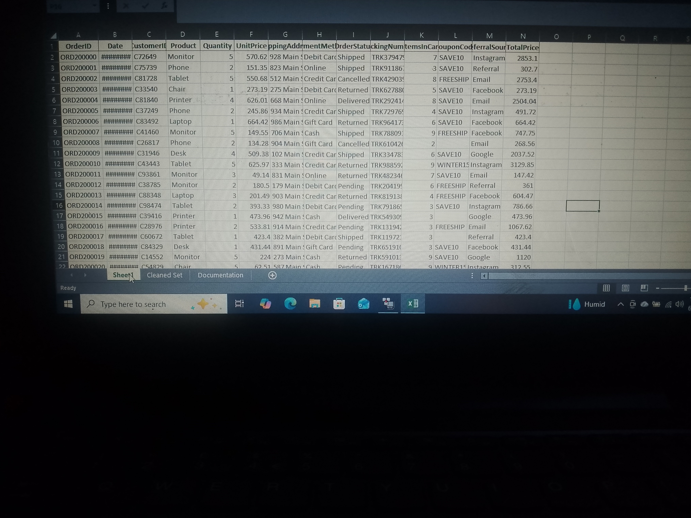
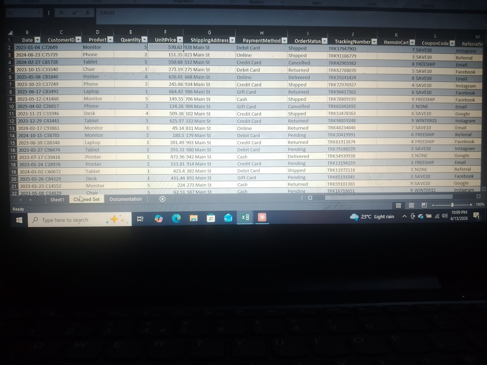

# DecodeLabs Data Cleaning Project

## Overview
This project focuses on cleaning and preparing raw sales data 
for analysis using Microsoft Excel and Power Query, as part of 
my DecodeLabs internship.

## Project Description
The purpose of this project was to clean and prepare raw 
sales data for analysis. Several data quality issues such as 
duplicates, missing values, inconsistent formatting, and 
incorrect data types were identified and corrected.

## Objectives
- Improve overall data quality
- Remove duplicate records
- Handle missing values
- Standardize data formats
- Prepare the dataset for analysis and reporting

## Tools Used
- Microsoft Excel
- Power Query 

## Dataset Information
Two real-world sales datasets containing 1,500 and 1,200 rows 
of business and operational records used for analytical 
reporting and data-driven decision-making.

## Data Cleaning Process
The following cleaning operations were performed using 
Power Query:
1. Removed duplicate rows
2. Handled missing values
3. Standardized text formatting
4. Changed incorrect data types
5. Renamed columns for consistency
6. Structured the dataset for analysis

---

## Messy Dataset
Initial raw dataset before cleaning and transformation.

---

## Power Query Techniques Used
- Remove Duplicates
- Replace Values
- Change Data Types
- Additional Columns
- Filtering and Sorting
- Data Transformation

## Power Query Transformation Steps
The following steps were applied in Power Query to clean 
and transform the dataset:

1. Connected to the raw Excel data source
2. Promoted first row as headers
3. Removed duplicate rows
4. Replaced missing/null values with appropriate defaults
5. Changed column data types to correct formats
6. Renamed columns for clarity and consistency
7. Removed irrelevant or empty columns
8. Filtered out invalid or erroneous records
9. Sorted data for better readability
10. Loaded cleaned data back into Excel

---

## Cleaned Dataset
Dataset after cleaning and preparation using Power Query.

---

## Challenges Faced
- Missing values across multiple columns
- Duplicate records affecting data integrity
- Inconsistent formatting
- Incorrect data types

## Outcome
The raw datasets were successfully transformed into clean, 
organized, and analysis-ready datasets suitable for reporting 
and further analysis.

---

## Author
Umanta — Data Analytics Intern
